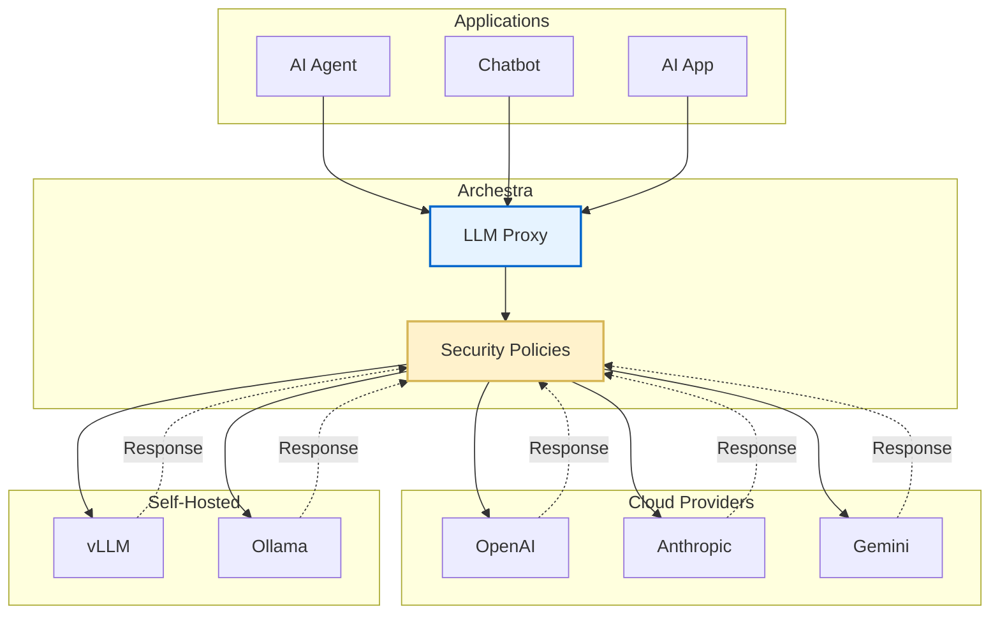

<!--
Check ../docs_writer_prompt.md before changing this file.

This document is human-built, shouldn't be updated with AI. Don't change anything here.

Exception:
- Screenshot
-->

LLM Proxy is Archestra's security layer that sits between AI agents and LLM providers (OpenAI, Anthropic, Google, etc.). It intercepts, analyzes, and modifies LLM requests and responses to enforce security policies, prevent data leakage, and ensure compliance with organizational guidelines.

## To use LLM Proxy:

1. Go to **LLM Proxies** and create a new LLM proxy
2. Click the **Connect** icon, choose the LLM provider you are using, and copy the provided URL.
3. Use this URL when calling your LLM provider instead of the provider's original endpoint.



## Authentication

The LLM Proxy supports direct provider API keys, virtual API keys, and JWKS via an external identity provider. See [Authentication](/docs/platform-llm-proxy-authentication) for details.

## Custom Headers

Archestra supports the following custom headers on LLM Proxy requests. All headers are optional.

| Header                     | Description                                                                                                                                                                                                                                          | Example Value                          |
| -------------------------- | ---------------------------------------------------------------------------------------------------------------------------------------------------------------------------------------------------------------------------------------------------- | -------------------------------------- |
| `X-Archestra-Agent-Id`     | Client-provided identifier for the calling agent or application. Stored with each interaction and included in Prometheus metrics as the `external_agent_id` label. Useful when multiple applications share the same LLM Proxy.                       | `my-chatbot-prod`                      |
| `X-Archestra-User-Id`      | Associates the request with a specific Archestra user. Automatically included when using the built-in Archestra Chat.                                                                                                                                | `123e4567-e89b-12d3-a456-426614174000` |
| `X-Archestra-Session-Id`   | Groups related LLM requests into a session - included in [trace attributes](/docs/platform-observability#distributed-tracing) as `gen_ai.conversation.id`.                                                                                           | `session-abc-123`                      |
| `X-Archestra-Execution-Id` | Associates the request with a specific execution run. Used for the `agent_executions_total` Prometheus metric which counts unique executions. See [Observability](/docs/platform-observability).                                                     | `exec-run-456`                         |
| `X-Archestra-Meta`         | Composite header combining agent ID, execution ID, and session ID in one value. Format: `<agent-id>/<execution-id>/<session-id>`. Any segment can be empty. Individual headers take precedence over meta header values. Values must not contain `/`. | `my-agent/exec-123/session-456`        |

### Usage

```bash
curl -X POST "https://your-archestra-instance/v1/openai/chat/completions" \
  -H "Authorization: Bearer $OPENAI_API_KEY" \
  -H "X-Archestra-Agent-Id: my-chatbot-prod" \
  -H "X-Archestra-Session-Id: session-abc-123" \
  -H "Content-Type: application/json" \
  -d '{
    "model": "gpt-4",
    "messages": [{"role": "user", "content": "Hello!"}]
  }'
```

Or equivalently using the composite meta header:

```bash
curl -X POST "https://your-archestra-instance/v1/openai/chat/completions" \
  -H "Authorization: Bearer $OPENAI_API_KEY" \
  -H "X-Archestra-Meta: my-chatbot-prod//session-abc-123" \
  -H "Content-Type: application/json" \
  -d '{
    "model": "gpt-4",
    "messages": [{"role": "user", "content": "Hello!"}]
  }'
```

## Supported Providers

For the full list of supported LLM providers, see [Supported LLM Providers](/docs/platform-supported-llm-providers).
