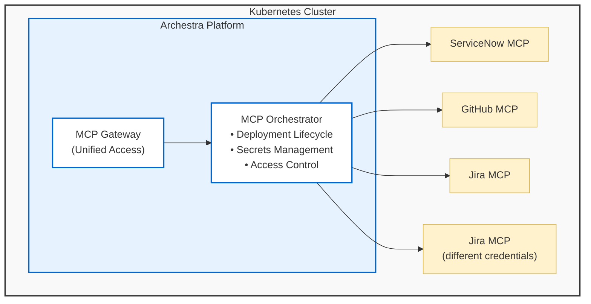

<!--
Check ../docs_writer_prompt.md before changing this file.

This document is human-built, shouldn't be updated with AI. Don't change anything here.

Exception:
- Screenshot
-->

The MCP Orchestrator is Archestra's system for running and managing MCP servers within your existing Kubernetes cluster. It handles the lifecycle of MCP server deployments, manages their secrets securely, and provides unified access through the MCP Gateway.

> **Note:** The MCP Orchestrator requires a Kubernetes (K8s) cluster to operate. You still could use Private MCP Registry, MCP Gateway and security features with remote MCP servers, or self-host them and connect to Archestra.

## How It Works

### Deployments

Each MCP server runs as a dedicated Kubernetes Deployment:

- **One Deployment Per Server**: Each MCP server gets its own isolated deployment
- **Automatic Lifecycle**: Deployments are automatically created, restarted, and managed
- **Custom Images**: Supports both standard and custom Docker images for MCP servers
- **Secret Management**: The orchestrator injects credentials and configuration

#### Configuration

MCP servers can be configured in two ways:

- **Remote** — Connect to an MCP server running outside your cluster by providing its URL. No K8s deployment is created.
- **Self-hosted** — Run an MCP server as a K8s deployment in your cluster. Two options:
  - **Base image + command/args** — Use the built-in MCP server base image and specify the command and arguments to run (e.g., `npx @modelcontextprotocol/server-github`), along with environment variables and other settings.
  - **Bring your own Docker image** — Provide a custom Docker image for the MCP server deployment.

For advanced use cases, you can directly edit the Kubernetes deployment YAML for a self-hosted MCP server, giving you full control over the pod spec.

#### Image Pull Secrets

If your self-hosted MCP server uses a Docker image from a private container registry, you'll need to configure image pull secrets so Kubernetes can authenticate when pulling the image. When a user installs an MCP server that has "credentials" image pull secrets configured, Archestra creates the corresponding `kubernetes.io/dockerconfigjson` secret in Kubernetes and labels it with the MCP server's team. Personal installations (no team) do not produce team-labeled secrets.

There are two options:

- **Use an existing Kubernetes secret** — Select a pre-existing `kubernetes.io/dockerconfigjson` secret from the Archestra platform namespace (the same namespace where MCP server deployments run). Useful when your cluster already has registry credentials managed externally (e.g., via Helm or a secrets operator). Only secrets created by Archestra are shown — users with the `mcpServer:admin` permission see all Archestra-managed secrets, while other users only see secrets belonging to their team(s).
- **Provide registry credentials** — Enter the registry server, username, and password directly. Archestra creates the docker-registry secret automatically and references it in the pod spec. The password is stored securely in the secrets manager and never saved in the catalog template.

You can configure multiple image pull secrets per server (e.g., if the image and init containers pull from different registries).

#### Scheduling Defaults

If `tolerations` or `nodeSelector` are configured in the Helm values for the Archestra platform pod, those values are automatically inherited as defaults by all self-hosted MCP server deployments. This ensures MCP servers are scheduled on the same node pool as the platform without additional configuration.

These defaults can be overridden per-server via the advanced YAML config. See [Service, Deployment, & Ingress Configuration](/docs/platform-deployment#service-deployment--ingress-configuration) for the relevant Helm values.

### Credentials

The orchestrator securely manages credentials for each MCP server. When you install a server from the [Private Registry](/docs/platform-private-registry), you authenticate with the external service — the resulting credential is stored and injected into the deployment at runtime.

Credentials can be **personal** (owned by a single user) or **team-scoped** (shared by all members of a team). When assigning tools to an MCP Gateway or Agent, you choose a specific credential or select "Resolve at call time" for dynamic per-user credential resolution.

> **Note:** For local MCP servers (running as K8s deployments), the "credential" is the deployment itself. The orchestrator routes tool calls to the correct deployment rather than injecting API tokens.

See [Authentication](/docs/mcp-authentication) for the full credential resolution logic, per-user credentials, and missing credential handling.
