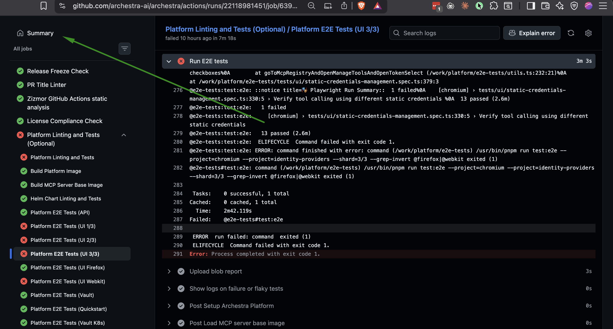
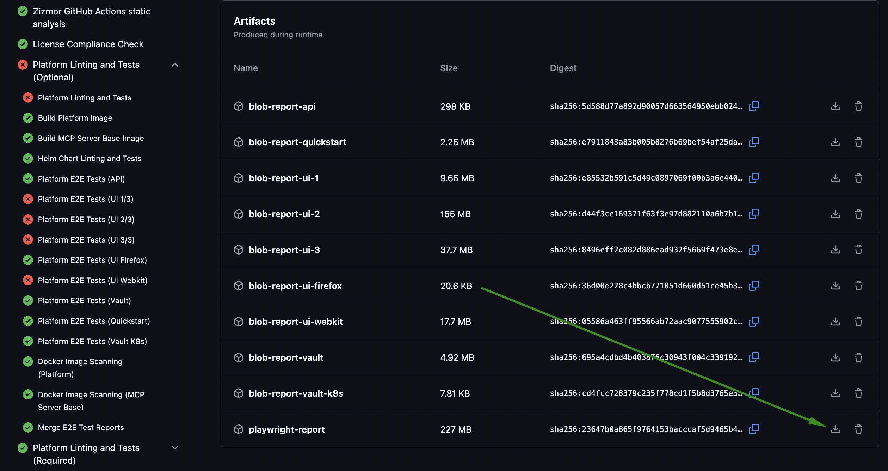
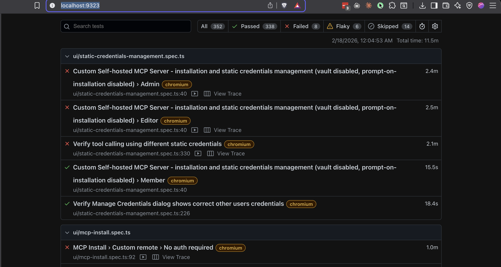
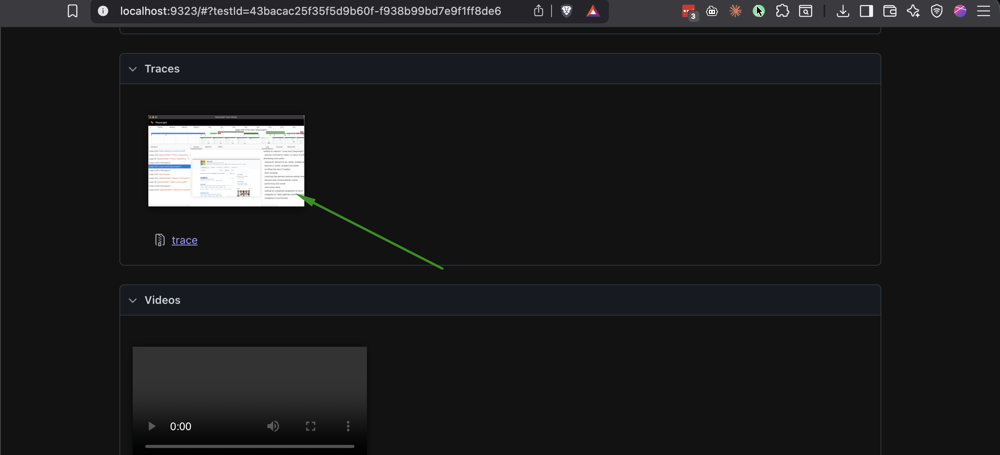
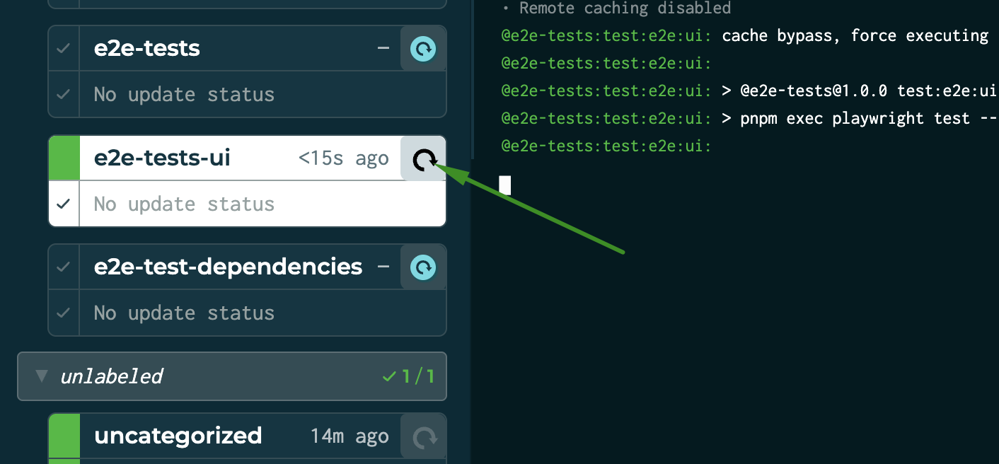
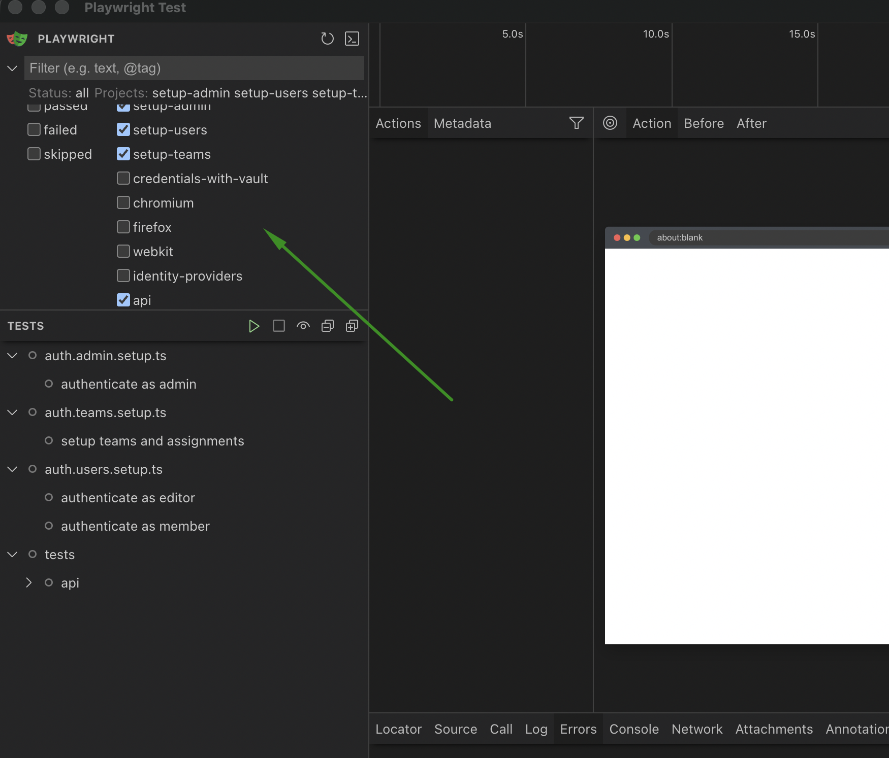
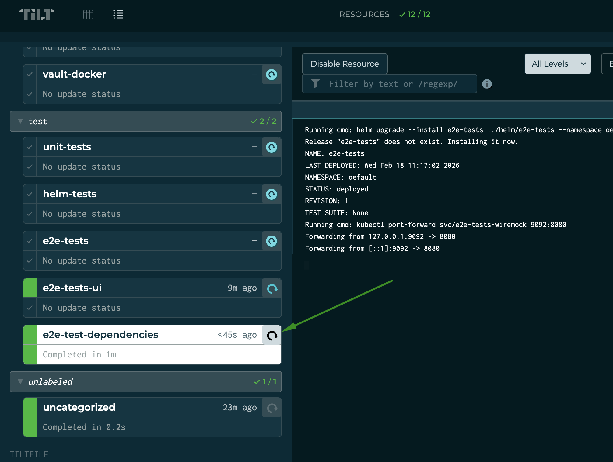

## Troubleshooting e2e tests that fail on CI

1. Go to the failing GitHub workflow run (e.g. from a PR check)
2. Click "Summary"



3. Scroll to the bottom and download the "playwright-report" artifact



4. Unzip the downloaded report
5. Open it with Playwright:
   ```bash
   npx playwright show-report <path-to-unzipped-report-folder>
   ```
6. The report opens automatically at `http://localhost:9323/`



7. Click on a failing test, scroll down, and click on the trace. The trace viewer lets you inspect step by step what happened during test execution.



## Running e2e tests locally via UI mode

1. Start Archestra with `tilt up`
2. In Tilt, click the trigger button on the `e2e-tests-ui` resource



3. Choose which projects to run. After a clean database, the `setup-*` projects are required on the first run (they create the users and teams that all other tests depend on). On subsequent runs you can disable them to save time.



4. Run test suites or individual tests using the play buttons


## WireMock

Some tests require WireMock to mock HTTP responses from LLM providers. To start it, trigger the `e2e-test-dependencies` resource in Tilt.



Then set the provider base URL env vars in your `.env`:
```
ARCHESTRA_OPENAI_BASE_URL=http://localhost:9092/openai/v1
ARCHESTRA_ANTHROPIC_BASE_URL=http://localhost:9092/anthropic
ARCHESTRA_GEMINI_BASE_URL=http://localhost:9092/gemini
ARCHESTRA_VLLM_BASE_URL=http://localhost:9092/vllm/v1
ARCHESTRA_OLLAMA_BASE_URL=http://localhost:9092/ollama/v1
ARCHESTRA_CEREBRAS_BASE_URL=http://localhost:9092/cerebras/v1
ARCHESTRA_ZHIPUAI_BASE_URL=http://localhost:9092/zhipuai/v4
ARCHESTRA_COHERE_BASE_URL=http://localhost:9092/cohere
ARCHESTRA_MISTRAL_BASE_URL=http://localhost:9092/mistral
ARCHESTRA_GROQ_BASE_URL=http://localhost:9092/groq/v1
```
